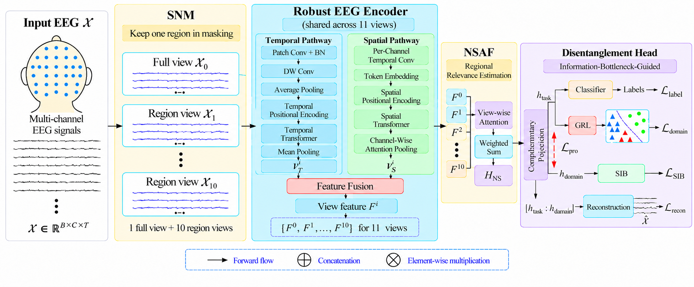

# NeuroMaskNet: Explainable Cross-Subject Auditory Attention Decoding


**Authors:** Tasleem Kausar, Haizhou Li  
**Affiliation:** School of Artificial Intelligence, The Chinese University of Hong Kong, Shenzhen, China

---

## Abstract

Cross-subject Auditory Attention Decoding (AAD) remains challenging due to substantial inter-subject variability and limited model interpretability. We propose **NeuroMaskNet**, an explainable framework that integrates a Structured NeuroMask Module (SNM), a shared spatio-temporal Transformer, NeuroSpatial Attention Fusion (NSAF), and information-bottleneck-guided disentanglement.

SNM generates anatomically isolated EEG views, while NSAF models region-specific neural relevance for interpretable decoding. Meanwhile, the disentanglement module separates task-relevant, subject-invariant information from subject-specific factors to improve generalization to unseen subjects. NeuroMaskNet achieves strong cross-subject performance on the KUL, DTU, and AVED datasets.

---

## Model Architecture

<p align="center">
  
</p>

NeuroMaskNet consists of four main components:

1. **Structured NeuroMask Module (SNM)** – generates one full-scalp and ten anatomically isolated EEG views.
2. **Shared Spatio-Temporal Transformer** – extracts complementary temporal and spatial representations.
3. **NeuroSpatial Attention Fusion (NSAF)** – adaptively models regional relevance.
4. **Disentanglement Head** – separates task-relevant and subject-specific representations.

## Installation & Usage

```bash
conda create -n neuromask python=3.8
conda activate neuromask
pip install torch numpy pandas scikit-learn tqdm matplotlib
python neuromask-net
```

## Main Results

### Comparison with State-of-the-Art Methods

| Dataset | Model | 1-second | 2-second |
| --- | --- | ---: | ---: |
| **KUL** | SSF-CNN | 59.3 ± 6.7 | 60.8 ± 8.4 |
|  | DBPNet | 61.1 ± 8.3 | 62.3 ± 7.4 |
|  | ListenNet | 63.6 ± 11.1 | 64.2 ± 12.4 |
|  | DARNet | 69.9 ± 11.8 | 71.9 ± 13.0 |
|  | FD-ARL | 74.5 ± 14.73 | 74.6 ± 14.04 |
|  | **NeuroMaskNet (Ours)** | **76.6 ± 13.6** | **77.2 ± 13.3** |
| **DTU** | SSF-CNN | 52.3 ± 3.5 | 53.4 ± 4.2 |
|  | DBPNet | 55.5 ± 6.3 | 55.8 ± 6.1 |
|  | ListenNet | 54.8 ± 4.4 | 55.1 ± 4.2 |
|  | DARNet | 55.6 ± 4.1 | 55.6 ± 4.0 |
|  | FD-ARL | 57.7 ± 4.68 | 58.1 ± 4.42 |
|  | **NeuroMaskNet (Ours)** | **57.8 ± 3.5** | **59.1 ± 3.7** |
